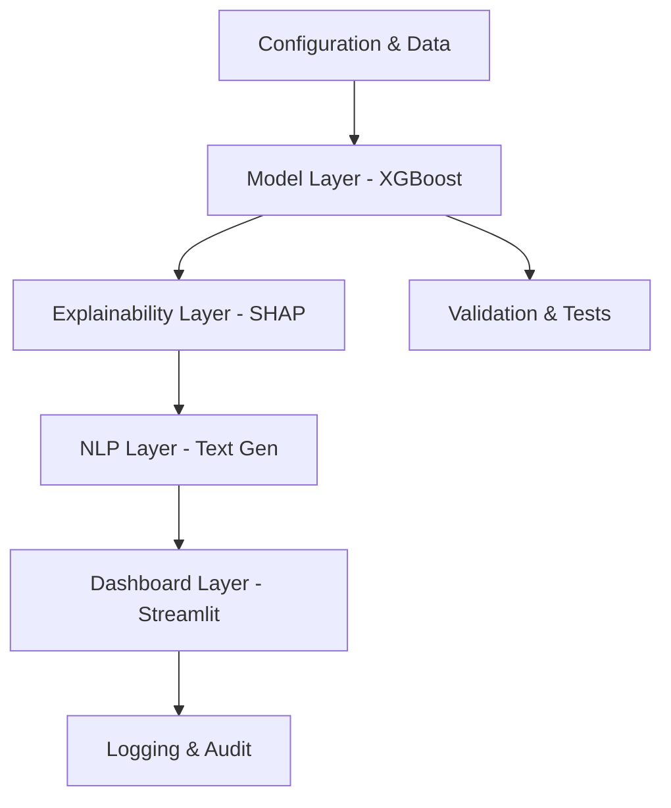

# Explainable AML System

An enterprise-ready, explainable Anti-Money Laundering (AML) risk detection system. This project demonstrates a production-grade architecture combining XGBoost for high-performance risk scoring, SHAP for model explainability, and a human-in-the-loop dashboard for detailed investigation.

## 🚀 Key Features

*   **Risk Detection**: XGBoost classifier trained on transactional patterns (amount, deviation, frequency, etc.).
*   **Explainable AI (XAI)**: SHAP (SHapley Additive exPlanations) values provide local feature attribution for every decision.
*   **Natural Language Explanations**: Automatically generates plain-English narratives explaining *why* a transaction was flagged.
*   **Production Architecture**: Modular design, configuration management, and input validation.
*   **Interactive Dashboard**: Streamlit-based UI for analysts to review cases and provide feedback.
*   **Governance & Logging**: Comprehensive JSON logging of every model decision, explanation, and user interaction.
*   **DevOps Ready**: Dockerized with CI/CD workflows and environment-specific configurations.

## 🏗️ Architecture

The system is organized into modular layers:



## 🛠️ Getting Started

### Prerequisites
*   Python 3.9+
*   Docker (optional, for containerization)

### Installation

1.  **Clone the repository:**
    ```bash
    git clone <repository-url>
    cd Explainable-AI
    ```

2.  **Set up the environment:**
    ```bash
    make setup
    ```
    This creates the virtual environment and installs dependencies (including dev tools).

## ⚙️ Configuration

The system uses YAML-based configuration for different environments.

*   **Development**: `config/dev.yaml` - Lower thresholds, fewer samples for speed.
*   **Production**: `config/prod.yaml` - Higher fidelity, robust logging.

Set the environment variable `ENV` to switch configurations (default is `dev`).

## 🏃 Usage

### 1. Train the Model
Train the XGBoost model on the dataset. Artifacts are saved to `src/explainable_aml/model/`.
```bash
python src/explainable_aml/model/train_model.py
```

### 2. Run the Dashboard
Launch the interactive Streamlit interface.
```bash
make run-dashboard
```
Access the dashboard at `http://localhost:8501`.

## 🧪 Development & Testing

We use `pytest` for testing and `black`/`flake8` for code quality.

*   **Run Unit Tests:**
    ```bash
    make test
    ```
*   **Lint & Format Code:**
    ```bash
    make lint
    make format
    ```

## 🐳 Deployment (Docker)

The application is fully containerized.

**Build and Run with Docker Compose:**
```bash
docker-compose up --build
```
This spins up the application in a production-like environment on port 8501.

## 📁 Project Structure

```
├── .github/            # CI/CD workflows
├── config/             # Environment configurations (dev.yaml, prod.yaml)
├── src/
│   └── explainable_aml/
│       ├── data/       # Data generation and raw files
│       ├── model/      # XGBoost training and artifacts
│       ├── explainability/ # SHAP logic
│       ├── nlp/        # Text generation logic
│       ├── dashboard/  # Streamlit app
│       └── utils/      # Logging and validation
├── tests/              # Pytest suite
├── Dockerfile          # Container definition
├── Makefile            # Command shortcuts
└── pyproject.toml      # Dependency management
```

## 📝 Governance
All decisions are logged to `src/explainable_aml/logs/aml_events.log` in JSON format, capturing:
- Input features
- Model risk score
- Threshold used
- Top contributing features (SHAP)
- OOD (Out-of-Distribution) warnings
