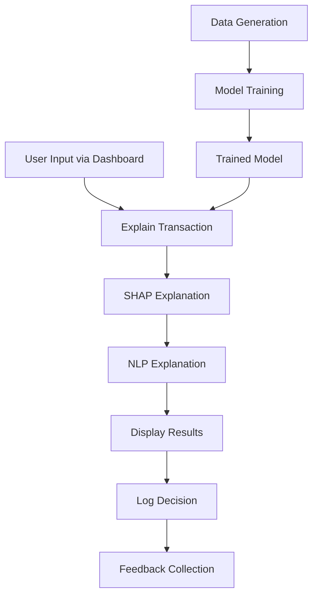

# High-Level Architecture for Explainable AML System

## Overview
The Explainable AML (Anti-Money Laundering) system is a prototype designed to score synthetic financial transactions for money laundering risk, provide transparent explanations using SHAP (SHapley Additive exPlanations), and generate plain-English interpretations. It includes a Streamlit-based dashboard for human-in-the-loop review and logging for governance.

## Key Components

### 1. Data Layer
- **Purpose**: Generates and stores synthetic transaction data for training and testing.
- **Modules**:
  - `data/generate_data.py`: Creates synthetic transactions with features like transaction_amount, amount_deviation, transaction_frequency, country_risk, customer_age, and a binary target (is_money_laundering).
  - `data/transactions.csv`: CSV file containing the generated dataset.
- **Dependencies**: pandas, numpy.

### 2. Model Layer
- **Purpose**: Trains and persists a machine learning model for risk prediction.
- **Modules**:
  - `model/train_model.py`: Trains an XGBoost classifier on the synthetic data and saves the model as a pickle file.
  - `model/risk_model.pkl`: Serialized trained model.
- **Dependencies**: pandas, scikit-learn, xgboost, joblib.

### 3. Explainability Layer
- **Purpose**: Provides model-agnostic explanations for individual predictions using SHAP.
- **Modules**:
  - `explainability/explain.py`: Loads the model, computes SHAP values for a given transaction, and returns risk score, alert flag, and top contributing features.
- **Dependencies**: shap, pandas, numpy, joblib.

### 4. NLP Layer
- **Purpose**: Converts SHAP attributions into human-readable plain-English explanations.
- **Modules**:
  - `nlp/generate_explanation.py`: Generates template-based text explanations from SHAP data and feature values.
- **Dependencies**: None (pure Python).

### 5. Dashboard Layer
- **Purpose**: Provides a user interface for transaction analysis and feedback collection.
- **Modules**:
  - `dashboard/app.py`: Streamlit application that takes user inputs, calls explanation functions, displays results (risk score, feature contributions, NLP explanation), and collects analyst feedback.
- **Dependencies**: streamlit, pandas.

### 6. Utilities Layer
- **Purpose**: Handles logging and other shared functionalities.
- **Modules**:
  - `utils/logging.py`: Logs decisions with timestamps, features, explanations, and feedback to a log file for auditability.
- **Dependencies**: logging, json.

### 7. Testing Layer
- **Purpose**: Integrates and tests the system components.
- **Modules**:
  - `test_system.py`: Runs an end-to-end test of the explanation pipeline.
- **Dependencies**: Imports from other modules.

## Data Flow

## Architecture Principles
- **Modularity**: Each layer is independent and can be developed/tested separately.
- **Explainability First**: Uses SHAP for transparent attributions, no black-box reasoning.
- **Governance**: All decisions are logged with full context for auditability.
- **Human-in-the-Loop**: Dashboard allows analysts to review and provide feedback.
- **Deterministic**: Fixed model and scoring logic, no agentic behavior.

## Technologies Used
- **Programming Language**: Python 3.9+
- **ML Framework**: XGBoost for classification
- **Explainability**: SHAP library
- **UI**: Streamlit
- **Data Processing**: pandas, numpy
- **Serialization**: joblib
- **Logging**: Python logging module

## Deployment
- **Local Development**: Run via `pip install -e .`, then `streamlit run src/explainable_aml/dashboard/app.py`
- **CLI Demo**: Execute `python src/explainable_aml/test_system.py` for testing
- **Model Training**: Run `python src/explainable_aml/model/train_model.py` to retrain

This architecture ensures the system is transparent, auditable, and focused on explainable AI for AML use cases.